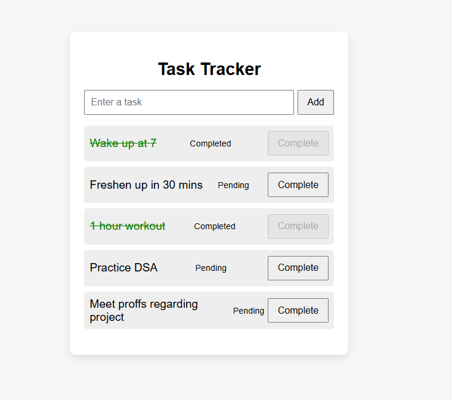

# 📝 Task Tracker Application

A simple and interactive **Task Tracker** web application built using **HTML, CSS, and JavaScript**.  
This project allows users to add tasks, view them, and mark tasks as completed.

---

## 🚀 Features

- ➕ Add new tasks
- 👀 View all tasks
- ✅ Mark tasks as **Completed**
- ⌨️ Add tasks using **Enter key** or **Add button**
- 🟢 Task status shown as **Pending / Completed**
- 🎨 Clean and minimal user interface

---

## 🛠️ Tech Stack

- **HTML** – Page structure
- **CSS** – Styling and layout
- **JavaScript** – Interactivity and DOM manipulation

---

## 📂 Project Structure

task-tracker/
├── index.html
├── style.css
├── script.js
├── README.md
└── assets/
└── task-tracker-demo.png  

## 📸 Application Screenshot

### Task Tracker UI

